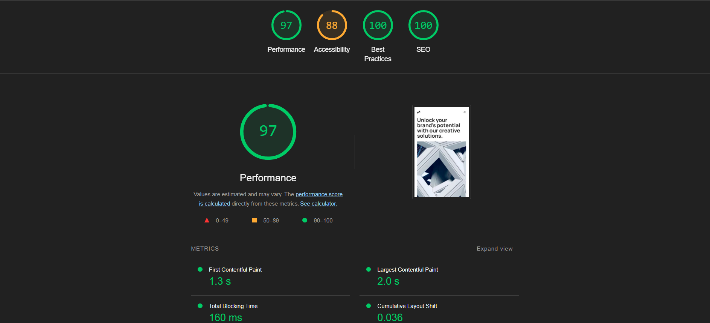

# Digital Marketing Agency

A modern, high-performance website for a digital marketing agency built with Next.js, TypeScript, and Tailwind CSS. This project features a professional site with smooth animations, optimized images, and a focus on accessibility and SEO.


## 📋 Table of Content

- [Project Overview](#project-overview)
- [Demo](#demo)
- [The Challenge](#the-challenge)
- [Features](#features)
- [Technologies Used](#technologies-used)
- [Installation](#installation)
- [Lighthouse Report](#lighthouse-report)
- [Contributing](#contributing)
- [License](#license)

## Project Overview

This project involved designing and developing a high-converting website for a digital marketing agency. The primary goal was to create a compelling digital presence that communicates value, builds trust, and drives client engagement, while optimizing for performance, accessibility, and SEO.

## Demo

Live demo: [Digital Marketing Agency](https://digital-marketing-agency-liard.vercel.app/)

## The Challenge

To design a website that could effectively:

- Clearly articulate the agency's unique value proposition and service offerings.
- Engage visitors immediately and guide them toward key calls to action.
- Build trust through social proof, testimonials, and a professional design.
- Provide a flawless, intuitive user experience across all device types: desktop, tablet, and mobile.
- Achieve high scores in Lighthouse for performance, accessibility, SEO, and best practices.

## The Solution

A meticulously designed, conversion-focused website featuring a clear user journey, compelling content, and responsive design, built with a modern tech stack.

### **1. Impactful Hero Section**
- **Clear Value Proposition:** Instantly communicates the agency's core offer and benefits.
- **Strong Call to Action (CTA):** Prominent button encourages immediate engagement.
- **Aspirational Imagery:** High-quality visuals set a professional tone.
- **Responsive Navigation:** Hamburger menu for mobile/tablet, full menu for desktop.

### **2. About Section with Company Stats**
- **Company Overview:** Brief, engaging description of the agency's mission and approach.
- **Key Statistics:** Highlights achievements (projects completed, team size, client satisfaction, years of experience) to build credibility.
- **Responsive Layout:** Stats adapt to all screen sizes.

### **3. Services Showcase**
- **Service List:** Clearly presents the agency's main offerings.
- **Benefit-Focused:** Describes how each service helps clients achieve their goals.
- **Modern Design:** Uses icons and visual cues for clarity.

### **4. Recent Work Portfolio**
- **Project Gallery:** Showcases recent projects with optimized images and descriptions.
- **Interactive Elements:** Hover effects and smooth transitions for engagement.
- **Responsive Grid:** Adapts to all devices.

### **5. Testimonials**
- **Social Proof:** Features real client feedback to build trust.
- **Professional Presentation:** Clean, readable layout with names and roles.
- **Responsive Adaptation:** Testimonials stack for mobile.

### **6. Call to Action**
- **Final Conversion Point:** Encourages visitors to get in touch or start a project.
- **Reinforced Benefits:** Reminds users of the agency's value.

### **7. Accessible Navigation & Footer**
- **Navigation:** Fully accessible, keyboard-friendly, and screen reader compatible.
- **Footer:** Includes contact info, social links, and legal information.

## Responsive Design

The website is fully responsive, ensuring an optimal and consistent user experience across all devices and screen sizes:

- **Desktop:** Multi-column layouts and expansive sections for rich content.
- **Tablet:** Optimized grids and stacking for clarity and usability.
- **Mobile:** Single-column stacking, larger touch targets, and optimized readability.

---

## Features

- **Modern Design** – Clean, professional UI for a digital agency
- **Fully Responsive** – Optimized for mobile, tablet, and desktop
- **Performance Focused** – Fast loading with lazy-loaded components and optimized images
- **Testimonials** – Real feedback from clients
- **Animations** – Smooth motion effects with Framer Motion
- **SEO Friendly** – Optimized metadata and semantic HTML
- **Accessibility** – WCAG-compliant design elements
- **Portfolio Gallery** – Interactive, responsive project showcase

## Technologies Used

- **Framework**: [Next.js](https://nextjs.org/) with App Router
- **Styling**: [Tailwind CSS](https://tailwindcss.com/)
- **Animations**: [Framer Motion](https://www.framer.com/motion/)
- **Image Optimization**: [Next/Image](https://nextjs.org/docs/pages/api-reference/components/image)
- **TypeScript**: Type-safe code
- **Deployment**: [Vercel](https://vercel.com/)

## Installation

### Prerequisites

- Node.js 18.0 or later
- npm or yarn

### Setup

1. Clone the repository:

   ```bash
   git clone https://github.com/yamami-mohammed-monsif/digital_marketing_agency.git
   cd digital_marketing_agency
   ```

2. Install dependencies:

   ```bash
   npm install
   # or
   yarn install
   ```

### Development

Run the development server:

```bash
npm run dev
# or
yarn dev
```

Open [http://localhost:3000](http://localhost:3000) in your browser.

### Production Build

Build for production:

```bash
npm run build
# or
yarn build
```

Start the production server:

```bash
npm run start
# or
yarn start
```

## Lighthouse Report

This project is optimized for performance, accessibility, SEO, and best practices.



## Contributing

Contributions are welcome! Please feel free to submit a Pull Request.

1. Fork the repository
2. Create your feature branch (`git checkout -b feature/amazing-feature`)
3. Commit your changes (`git commit -m 'Add some amazing feature'`)
4. Push to the branch (`git push origin feature/amazing-feature`)
5. Open a Pull Request

## License

This project is licensed under the MIT License - see the [LICENSE.txt](./LICENCE.txt) file for details.

---

Designed and developed with ❤️ using Next.js, TypeScript, and Tailwind CSS.
